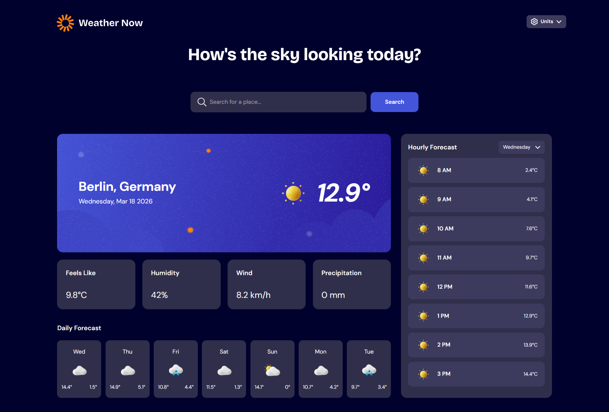

# Frontend Mentor - Weather app solution

This is a solution to the [Weather app challenge on Frontend Mentor](https://www.frontendmentor.io/challenges/weather-app-K1FhddVm49). Frontend Mentor challenges help you improve your coding skills by building realistic projects.

## Table of contents

- [Overview](#overview)
    - [The challenge](#the-challenge)
    - [Screenshot](#screenshot)
    - [Links](#links)
- [My process](#my-process)
    - [Built with](#built-with)
    - [What I learned](#what-i-learned)
    - [Continued development](#continued-development)
    - [AI Collaboration](#ai-collaboration)
- [Author](#author)

**Note: Delete this note and update the table of contents based on what sections you keep.**

## Overview

### The challenge

Users should be able to:

- Search for weather information by entering a location in the search bar
- View current weather conditions including temperature, weather icon, and location details
- See additional weather metrics like "feels like" temperature, humidity percentage, wind speed, and precipitation amounts
- Browse a 7-day weather forecast with daily high/low temperatures and weather icons
- View an hourly forecast showing temperature changes throughout the day
- Switch between different days of the week using the day selector in the hourly forecast section
- Toggle between Imperial and Metric measurement units via the units dropdown
- Switch between specific temperature units (Celsius and Fahrenheit) and measurement units for wind speed (km/h and mph) and precipitation (millimeters) via the units dropdown
- View the optimal layout for the interface depending on their device's screen size
- See hover and focus states for all interactive elements on the page

 Added Functionalities

- Added progressive web app (PWA) capabilities for mobile installation
- Added geolocation detection to automatically show weather for the user's current location on first visit

### Screenshot

### Links

- Solution URL: [View Code on Github](https://github.com/Israeloyedele/weather)
- Live Site URL: [View Live Site](https://weather-five-gules-67.vercel.app/)

## My process

### Built with

- Semantic HTML5 markup
- CSS custom properties
- Flexbox
- CSS Grid
- Mobile-first workflow
- [React](https://reactjs.org/) - JS library
- [TailwindCSS](https://tailwindcss.com/docs) - For styles

### What I learned

I learned more about handling errors from an API and handling them gracefully so my app doesn't break, I also learned how to make a Progressive Web App.

### Continued development

I want to focus more on building more full stack Apps moving forward.

### AI Collaboration

I used ChatGPT to write some verbose logic like the switch-case to convert weather codes to its equivalent weather icon url and also some data handling logic.
Also used it brainstorm how i could get my custom dropdown without using HTML select element.

## Author

- Website - [Israel Oyedele](https://www.israeloyedele.com/)
- Frontend Mentor - [@Israeloyedele](https://www.frontendmentor.io/profile/Israeloyedele)

